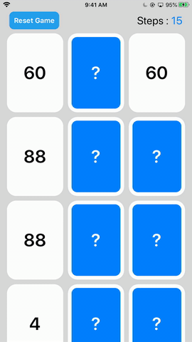
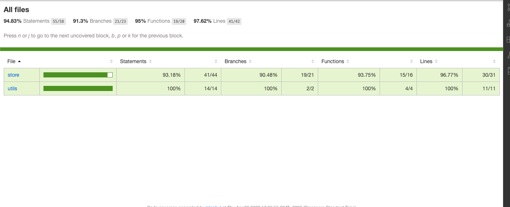

# React Native Flip Game

A Project built using React Native - Javascript.

Built with Expo CLI , As recommended by RN Team (https://reactnative.dev/docs/environment-setup);

## Accessing the Completed App

Completed Deployed Application can be viewed at this page.
(https://expo.io/@sheen4n/native-card-flip-game)
Or Scan the QR Code 

- You need to download Expo App from App Store or Google Play first.

### Demo



### Test coverage



#### Run in Local Environment

Getting Started

These instructions will get you a copy of the project up and running on your local machine for development and testing purposes. See deployment for notes on how to deploy the project on a live system.

Prerequisites

What things you need to install the software and how to install them

```
Expo Cli needs to be installed (with NPM and NODE)

```

Steps:
1 - "expo install"
2 - "expo start"

You can then previwew the application.

```

## Authors

- Done by Goh Sheen An
```
